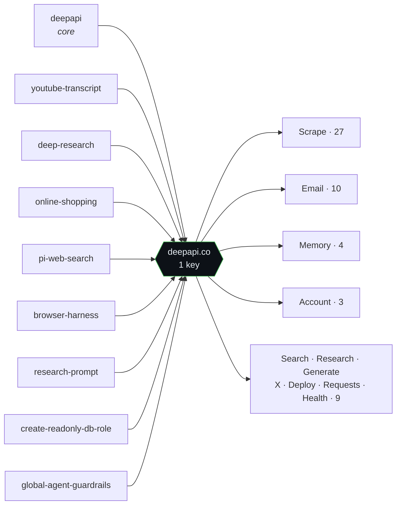
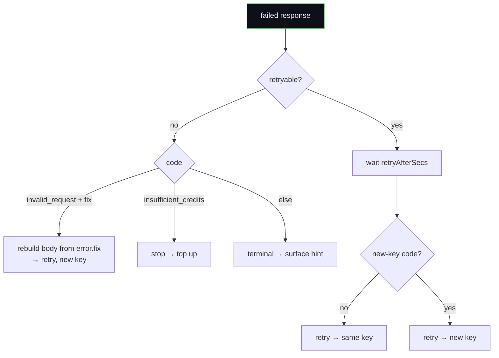

# deepapi-recon

Reconstructing the **DeepAPI** contract from nothing but its public
[`davidondrej/skills`](https://github.com/davidondrej/skills) repo — no key, no
account, no billed calls. One tool reads the skill files and extracts the whole
surface; the other turns that surface into a working client.

Everything below is generated by running the tools against a fresh clone
(`HEAD d88deb0`) plus two free probes. Raw output lives in [`results/`](results/).

| Tool | What it does |
|---|---|
| [`analyze_deepapi.py`](analyze_deepapi.py) | Walks every skill file and extracts endpoints, URLs, env vars, and mention counts → [`results/deepapi_report.json`](results/deepapi_report.json). ~50 lines, stdlib only. |
| [`deepapi_client.py`](deepapi_client.py) | Implements the `deepapi/SKILL.md` contract: bearer auth (key never printed), idempotency keys, per-endpoint cost caps, async polling, and the full retry/self-correction logic below. ~140 lines, stdlib only. |

---

## The surface

**36** skills in the repo, **9** route through DeepAPI, exposing **53** operations
across **11** families — all behind a single key, `DEEPAPI_API_KEY`.



53 unique operations, grouped by family (`· ≤$` = default `maxCostUsd` cap the
client applies). Full raw list: [`results/endpoint-matrix.md`](results/endpoint-matrix.md).

| Family | Ops | Endpoints |
|---|---:|---|
| **Scrape** | 27 | `website` ≤$1.00 · `pdf` · `github` +`/profile` ≤$0.03 `/repo` `/contents` `/commits` `/pulls` `/issues` `/search` · `linkedin` +`/profile` ≤$0.05 `/company` `/people` `/jobs` `/posts` · `twitter` +`/search` ≤$0.03 `/user` `/replies` · `instagram/profile` `/posts` `/comments` · `youtube/transcript` ≤$0.05 `/channel` `/search` `/shorts` |
| **Search** | 1 | `POST /v1/search/web` ≤$0.05 |
| **Research** | 1 | `POST /v1/research/deep` ≤$0.10 |
| **Generate** | 1 | `POST /v1/generate/image` ≤$0.20 |
| **Email** | 10 | domains (list/add/verify/delete) · identities · drafts + send · messages · `POST /v1/email/send` |
| **Memory** | 4 | `GET /v1/memory` · `GET/POST/DELETE /v1/memory/{path}` |
| **X** | 2 | `GET /v1/x/connection` · `POST /v1/x/post` |
| **Deploy** | 1 | `POST /v1/deploy` |
| **Requests** | 2 | `GET /v1/requests` · `/{requestId}` |
| **Account** | 3 | `GET /v1/me` · `/balance` · `/usage` |
| **Health** | 1 | `GET /v1/health` |

---

## The error contract, distilled

The skill documents **51 error codes** — but they aren't 51 special cases. Every
failed response carries the same three fields (`error.retryable`,
`error.retryAfterSecs`, `error.hint`), so the whole table collapses to **six
behaviours**, and the client implements all of them in ~15 lines.

```
HTTP class     count
502  server     ███████████████████  19   → free; back off, retry same key, check /v1/health
403  policy     ███████████          11   → terminal: fix identifier / ask user
404  not-found  ███████               7   → terminal: check the id
409  conflict   ███                   3   → poll same key, or re-GET and merge
429  rate       ██                    2   → back off (same key, or new for upstream)
402  credits    ██                    2   → stop: top up or lower maxCostUsd
401  auth       ██                    2   → send / refresh the key
400  bad-req    ██                    2   → self-correct from error.fix, retry new key
503·501·422    ███                   3   → terminal
```

The elegant part is **`invalid_request`**: instead of a prose message, it returns
`error.fix` — the expected `bodySchema`, `requiredFields`, and a known-good
`exampleBody`. The client rebuilds the request against that schema and retries
with a fresh key, so an agent self-corrects without ever fetching docs:



Two details the table makes load-bearing, both honored by the client: retries
reuse the **same** idempotency key except for the codes marked otherwise
(`upstream_rate_limited`, `request_failed`), and **failed calls are free** —
every failure reports `debitMicrousd: null`.

---

## Tests — the happy path is the mistake

Each gap is a real DeepAPI error whose *obvious* reaction is wrong. The suite
runs both clients against an in-process fake — no key, no network — and pins the
difference:

```
  gap                                    naive   fixed
  ------------------------------------------------------
  1  same-key idempotency on retry         ✗       ✓
     naive mints a fresh key each retry → double-execute risk
  2  bounded retries (no infinite loop)    ✗       ✓
     naive recurses forever on a persistent retryable error
  3  error.fix self-correction             ✗       ✓
     naive drops error.fix and gives up on invalid_request
```

```bash
python3 tests/test_contract.py            # prints the matrix above, then asserts
python3 -m unittest discover -s tests     # plain unittest, exit code for CI
```

The naive baseline ([`tests/_naive_client.py`](tests/_naive_client.py)) is kept
as a fixture, so the three fixes stay honest rather than asserted into existence.

---

## CI — the audit as code scanning

`contract_audit.py` turns those three checks into a security auditor: it runs
them against a target client and emits **SARIF 2.1.0**, so each violation lands
as a GitHub code-scanning alert on the offending line. The
[workflow](.github/workflows/contract-audit.yml) runs the tests, audits the
naive baseline **and** the shipped client, renders a visual job summary with
[sarif-tools](https://github.com/microsoft/sarif-tools), and uploads the SARIF.

| target | verdict |
|---|---|
| `deepapi_client.py` (shipped) | ✅ clean — honors every rule |
| `tests/_naive_client.py` (baseline) | 🔴🔴🟠 three findings ↓ |

| sev | rule | location |
|---|---|---|
| 🔴 error | `deepapi-client/idempotency-key-not-reused` | `tests/_naive_client.py:45` |
| 🔴 error | `deepapi-client/unbounded-retry-recursion` | `tests/_naive_client.py:59` |
| 🟠 warning | `deepapi-client/error-fix-ignored` | `tests/_naive_client.py:62` |

```bash
python3 contract_audit.py --target tests/_naive_client.py --out results.sarif
python3 contract_audit.py --target deepapi_client.py          # → clean
```

The three baseline findings are live in the repo's
[**Security tab**](https://github.com/ANcpLua/deepapi-recon/security/code-scanning)
(2 high, 1 medium, anchored to `tests/_naive_client.py`). A committed sample of
the job summary and the emitted SARIF also lives in [`audit/`](audit/)
([SUMMARY.md](audit/SUMMARY.md) · [results.sarif](audit/results.sarif)).

> Note: code-scanning upload is free on public repos; on a **private** repo it
> needs GitHub Advanced Security, so the workflow keeps that step best-effort —
> the job summary and SARIF/HTML artifacts land regardless.

---

## Live verification (unauthenticated, $0)

Two probes against production, no key — so nothing bills, and the `401` is the
correct result. Both match the contract the files describe.

```
GET  /v1/health          → 200  {"ok":true,"skillVersion":"d60536539c35"}
POST /v1/search/web       → 401  { ...full envelope..., "error":{"code":"missing_api_key",
   (no key)                        "hint":"Send Authorization: Bearer $DEEPAPI_API_KEY",
                                    "docsUrl":"https://deepapi.co/llms.txt"} }
```

The `401` returns the **same envelope shape as a success** — machine-readable
`error.code`, a `hint`, a `docsUrl`, and the live `skillVersion` on every
response. That's what makes the API pleasant to automate: an agent branches on
`error.code` and self-corrects, and can detect skill drift and self-update.
Full captures in [`results/live-probes.md`](results/live-probes.md).

---

## Reproduce

```bash
mkdir -p skills && git clone --depth 1 https://github.com/davidondrej/skills.git skills/skills-main
python3 analyze_deepapi.py                    # → results/deepapi_report.json + summary

export DEEPAPI_API_KEY=...                     # from deepapi.co — keychain, never hardcode
python3 deepapi_client.py search "node lts version"
```

**Provenance.** Public `SKILL.md` files and two unauthenticated probes only — no
key, no credits, no access to the gated product. The client is written against
the contract but was **never run** (it makes billed calls). Counts are what the
regex extracts: 60 raw matches → 53 unique ops. All reproducible from the above.
