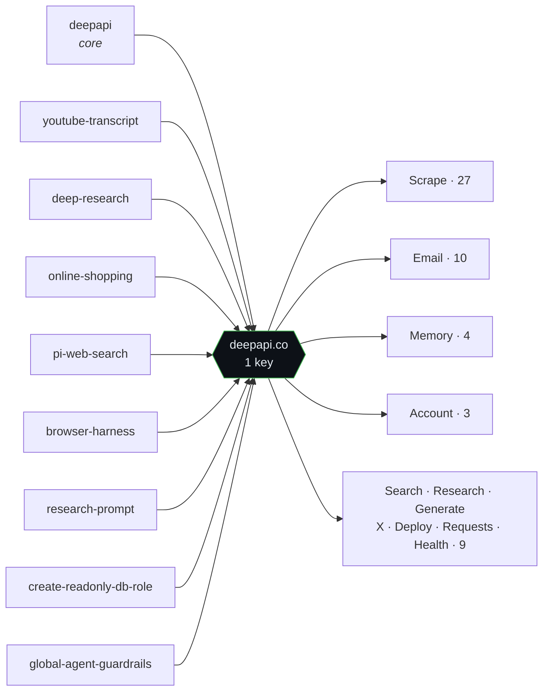

# deepapi-recon

Two small tools that map the **DeepAPI** surface straight from its public
[`davidondrej/skills`](https://github.com/davidondrej/skills) repo — no key, no
account, no billed calls. One tool reads the skill files and extracts the whole
API contract; the other implements that contract as a runnable client.

Everything below is **generated by running `analyze_deepapi.py`** against a fresh
clone (`HEAD d88deb0`, "Publish sanitized skills snapshot"), plus two
unauthenticated live probes. Raw output is in [`results/`](results/).

---

## The two tools

| Tool | What it does |
|---|---|
| [`analyze_deepapi.py`](analyze_deepapi.py) | Walks every skill file, regex-extracts DeepAPI endpoints, URLs, env vars, and per-file mention counts, and writes [`deepapi_report.json`](results/deepapi_report.json). ~50 lines, stdlib only. |
| [`deepapi_client.py`](deepapi_client.py) | A working client of the `deepapi/SKILL.md` contract: bearer auth from `DEEPAPI_API_KEY` (never printed), unique `Idempotency-Key` per POST, per-endpoint `maxCostUsd` caps, async poll to `succeeded`/`failed`, `retryable` backoff, `402` credit handling. ~90 lines, stdlib only. |

---

## What the sweep found

```
36  skill files in the repo
 9  route through DeepAPI                    (25%)
53  unique API operations across 11 families
132 DeepAPI mentions in the skill tree
 1  key powers all of it → DEEPAPI_API_KEY
```

### The 9 skills that call DeepAPI



| Skill | Category | What it uses DeepAPI for |
|---|---|---|
| **deepapi** | research-and-web | Core skill — web search + deep research, the shared client contract |
| **youtube-transcript** | research-and-web | Fetch/extract YouTube transcripts |
| **deep-research** | research-and-web | Source-backed deep research queries |
| **online-shopping** | research-and-web | Fair-price checks, best-deal / where-to-buy research |
| **pi-web-search** | research-and-web | Web access path for "Pi" agents |
| **browser-harness** | research-and-web | Browser control / scrape / automate via CDP |
| **research-prompt** | research-and-web | Author single-paragraph deep-research prompts |
| **create-readonly-db-role** | ops-and-setup | Referenced in the hardened SELECT-only Postgres setup |
| **global-agent-guardrails** | ops-and-setup | Referenced in the shared catastrophic-command denylist |

### Where the mentions concentrate

Raw DeepAPI mentions per file (132 total). One file carries the contract; the rest just consume it:

```
deepapi/SKILL.md          83  ██████████████████████████████
hooks/test-guard.sh       12  ████  (a hook, not a skill)
youtube-transcript        11  ████
deep-research              9  ███
online-shopping            9  ███
pi-web-search              4  █
create-readonly-db-role    1  ▏
global-agent-guardrails    1  ▏
browser-harness            1  ▏
research-prompt            1  ▏
```

### Env vars in the tree

| Variable | Occurrences | Note |
|---|---:|---|
| `DEEPAPI_API_KEY` | 69 | the one key that unlocks all 53 operations |
| `DEEPAPI_KEY` | 2 | shorthand variant seen in prose |
| `BROWSER_USE_API_KEY` | 1 | unrelated (browser-harness fallback) |
| `GEMINI_API_KEY` | 1 | unrelated |

---

## The full endpoint matrix

53 unique operations, extracted from the skill files and grouped by family
(`· ≤$` = default `maxCostUsd` cap encoded in the client). Full raw list in
[`results/endpoint-matrix.md`](results/endpoint-matrix.md).

| Capability family | Ops | Endpoints |
|---|---:|---|
| **Scrape** | 27 | `POST /v1/scrape/website` · ≤$1.00 <br> `POST /v1/scrape/pdf` <br> `POST /v1/scrape/github` + `/profile` ≤$0.03 `/repo` `/repo/contents` `/commits` `/pulls` `/issues` `/search` <br> `POST /v1/scrape/linkedin` + `/profile` ≤$0.05 `/company` `/people` `/jobs` `/posts` <br> `POST /v1/scrape/twitter` + `/search` ≤$0.03 `/user` `/replies` <br> `POST /v1/scrape/instagram/profile` `/posts` `/comments` <br> `POST /v1/scrape/youtube/transcript` ≤$0.05 `/channel` `/search` `/shorts` |
| **Search** | 1 | `POST /v1/search/web` · ≤$0.05 |
| **Research** | 1 | `POST /v1/research/deep` · ≤$0.10 |
| **Generate** | 1 | `POST /v1/generate/image` · ≤$0.20 |
| **Email** | 10 | `GET/POST /v1/email/domains` · `DELETE /v1/email/domains/{id}` · `POST …/{id}/verify` · `GET /v1/email/identities` `POST …` · `GET /v1/email/drafts` `POST …/{id}/send` · `GET /v1/email/messages` · `POST /v1/email/send` |
| **Memory** | 4 | `GET /v1/memory` · `GET/POST/DELETE /v1/memory/{path}` |
| **X (Twitter) actions** | 2 | `GET /v1/x/connection` · `POST /v1/x/post` |
| **Deploy** | 1 | `POST /v1/deploy` |
| **Requests** | 2 | `GET /v1/requests` · `GET /v1/requests/{requestId}` |
| **Account** | 3 | `GET /v1/me` · `GET /v1/balance` · `GET /v1/usage` |
| **Health** | 1 | `GET /v1/health` |

---

## Live verification (unauthenticated, $0)

Two probes against production — no key, so no billed work happens. Both confirm
the contract the skill files describe.

**1 · `GET /v1/health` → `200`**

```json
{ "ok": true, "skillVersion": "d60536539c35" }
```

**2 · `POST /v1/search/web` with no key → `401`**

```json
{
  "requestId": null, "route": "/v1/search/web", "capability": "search.web",
  "status": "failed", "replayed": false, "costFinal": false,
  "debitMicrousd": null, "output": null, "balance": null, "next": null,
  "error": {
    "code": "missing_api_key", "message": "Missing bearer API key",
    "retryable": false, "docsUrl": "https://deepapi.co/llms.txt",
    "hint": "Send `Authorization: Bearer $DEEPAPI_API_KEY`."
  },
  "skillVersion": "d60536539c35"
}
```

The `401` returns the **full structured envelope** — same shape as a success,
with a machine-readable `error.code`, a `hint`, and a `docsUrl` — instead of a
bare status line. That's deliberate, agent-friendly error design: an autonomous
agent can branch on `error.code == "missing_api_key"` and self-correct without a
human reading prose. The `skillVersion` also travels on every response, so a
client can detect drift against its cached skill and self-update.

---

## Reproduce

```bash
# analyzer expects the repo at ./skills/skills-main
mkdir -p skills && git clone --depth 1 https://github.com/davidondrej/skills.git skills/skills-main
python3 analyze_deepapi.py        # writes results/deepapi_report.json + prints summary

# client (needs a key + credits — makes live billed calls)
export DEEPAPI_API_KEY=...        # from deepapi.co; store in a keychain, don't hardcode
python3 deepapi_client.py search "node lts version"
```

---

## Provenance & honesty

- **Public files only.** Every finding comes from the open-source `SKILL.md`
  files in `davidondrej/skills` and two unauthenticated probes. No key, no
  credits, no access to the gated product.
- **The client was never run** against the API — it makes live, billed calls and
  there's no key. It's included to show the contract is understood end to end.
- Endpoint counts are what the regex extracts (60 raw matches → 53 unique ops
  after dropping method-less duplicates and prose artifacts). Numbers are
  reproducible from the command above.
